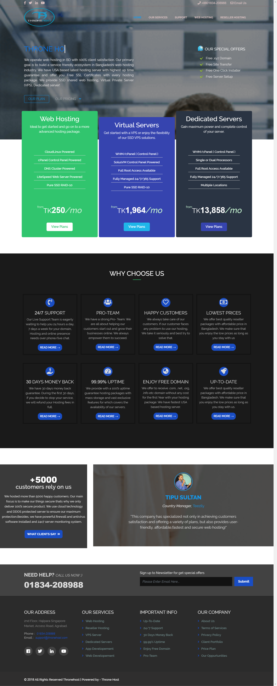

# ThoneHost

ThroneHost is a Hosting Template which is managed with JQuery, bootstrap, HTML & CSS.

## What's included
 - Focused to develop lucrative & animated UI.
 - Tried my best to manage RWD (Responsive Web Design). 
 - Taken some steps keeping user satisfaction in mind such as compressing code & img, lazyLoad, smooth scrolling.

### How I built it
JS, JQuery, Bootstrap4, HTML5 and CSS3 is used to build that UI.

### Useful Links
 - Demo: http://thronehost.com/

### Screenshot of Homepage
 